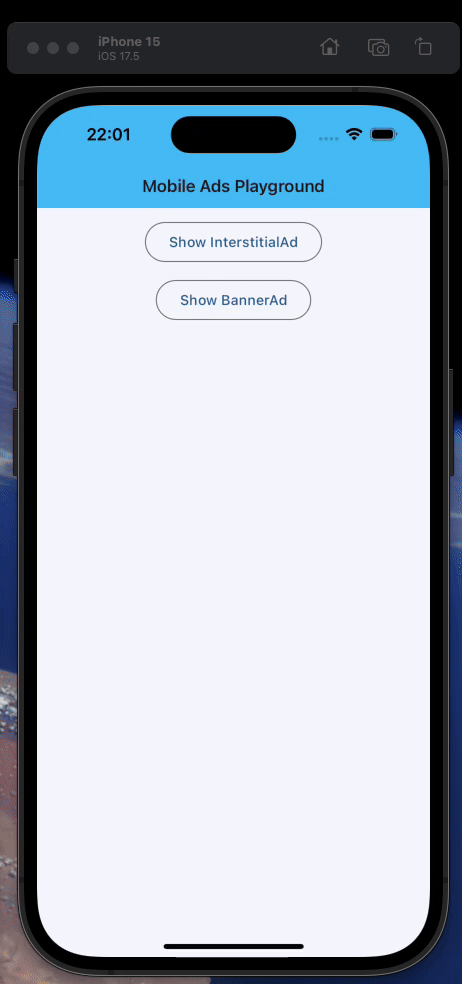

# flet-ads

[](https://pypi.python.org/pypi/flet-ads)
[](https://pepy.tech/project/flet-ads)
[](https://github.com/flet-dev/flet-ads/blob/main/LICENSE)

Display Google Ads in Flet apps.

It is based on the [google_mobile_ads](https://pub.dev/packages/google_mobile_ads) Flutter package.

## Platform Support

This package supports the following platforms:

| Platform | Supported |
|----------|:---------:|
| Windows  |     ❌     |
| macOS    |     ❌     |
| Linux    |     ❌     |
| iOS      |     ✅     |
| Android  |     ✅     |
| Web      |     ❌     |

## Packaging

The following are to be done when packaging an app that uses the `flet-ads` package.

### Add to dependencies

Add `flet-ads` to `dependencies` key of the `[project]` section of your `pyproject.toml` configuration file, for
example:

```toml
dependencies = [
  "flet-ads",
  "flet",
]
```

### Specify AdMob app ID

Specify your [AdMob app ID](https://support.google.com/admob/answer/7356431), without which your application might crash
on launch.

You can specify the app ID in two ways:

- In your `pyproject.toml` file:

```toml
# for Android
[tool.flet.android.meta_data]
"com.google.android.gms.ads.APPLICATION_ID" = "ca-app-pub-xxxxxxxxxxxxxxxx~yyyyyyyyyy"

# for iOS
[tool.flet.ios.info]
GADApplicationIdentifier = "ca-app-pub-xxxxxxxxxxxxxxxx~yyyyyyyyyy"
```

- In your build command from the terminal:

```bash
# for Android
flet build apk ... --android-meta-data com.google.android.gms.ads.APPLICATION_ID=ca-app-pub-xxxxxxxxxxxxxxxx~yyyyyyyyyy

# for iOS
flet build ipa ... --info-plist GADApplicationIdentifier=ca-app-pub-xxxxxxxxxxxxxxxx~yyyyyyyyyy
```


!!! tip "Test Values"
    AdMob [provides](https://developers.google.com/admob/flutter/banner#always_test_with_test_ads) app and ad unit IDs for testing purposes.

    - AdMob app ID: `"ca-app-pub-3940256099942544~3347511713"`
    - `BannerAd.unit_id` on **Android**: `"ca-app-pub-3940256099942544/9214589741"`
    - `BannerAd.unit_id` on **iOS**: `"ca-app-pub-3940256099942544/2435281174"`
    - `InterstitialAd.unit_id` on **Android**: `"ca-app-pub-3940256099942544/1033173712"`
    - `InterstitialAd.unit_id` on **iOS**: `"ca-app-pub-3940256099942544/4411468910"`

Remember to replace these values with your own when you're ready to package your app.

## Example

```python title="main.py"
--8<-- "examples/ads_example/src/main.py"
``` 


